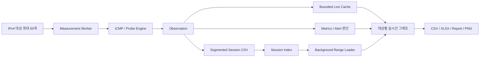
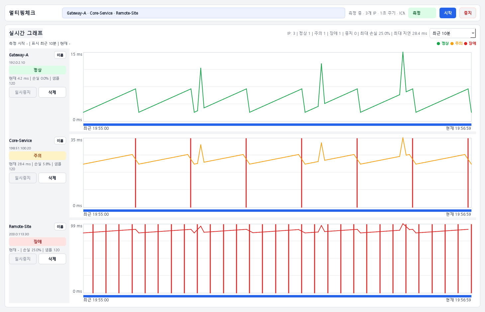

# MultiPingCheck — 다중 대상 네트워크 품질 모니터링

[](https://github.com/sebia1993/ping/actions/workflows/windows-fast-check.yml)

**최대 50개의 IPv4 대상을 주기적으로 측정해 지연시간·패킷 손실·상태 변화를 실시간으로 표시하고, 장시간 측정 이력을 세션 단위로 보존·복구하는 Windows 네트워크 관측 도구입니다.**

단발성 `ping` 확인보다 **여러 대상을 오래 측정했을 때 UI가 멈추지 않는지, timeout 대상이 전체 측정을 지연시키지 않는지, 측정 이력이 누락되지 않는지, 과거 세션을 다시 열어 문제 시간대를 분석할 수 있는지**에 초점을 두고 있습니다.

> 문서와 테스트에는 RFC 5737 문서용 주소와 simulated probe를 사용합니다. 실제 운영망 IP, 고객/사이트 정보, 사내 로그 원문은 공개 저장소에 포함하지 않습니다.

## 한눈에 보기

| 항목 | 내용 |
|---|---|
| 대상 | IPv4 최대 50개 |
| 기본 측정 | ICMP, 최종 대상 중심 |
| 기본 주기 | 1초 |
| 주요 지표 | 현재/평균 지연, 손실률, 지연 변동, 샘플 수 |
| 상태 | 정상 / 주의 / 장애 / 대기 / 일시중지 |
| 실시간 그래프 | 대상별 독립 그래프 행 |
| 그래프 범위 | 최근 1/5/10/30분, 1시간, 측정 전체 |
| 장시간 저장 | 대상·월 단위 segmented CSV + Session Index |
| 세션 복구 | 비정상 종료·부분 손상·누락 파일 상태를 구분해 복구/격리 |
| 내보내기 | CSV / XLSX / TXT·HTML 보고서 / PNG / 통계 |
| 실행 환경 | Windows 일반 사용자 권한, PySide6 |
| 배포 | `MultiPingCheck.exe` 포함 Windows ZIP |
| 안정성 검증 | deterministic 50-target soak + 4/8/24시간 및 UI 10/20/50대 프로필 |

## 해결하려 한 운영 문제

네트워크 장애가 간헐적으로 발생하면 장애 순간에 단발성 Ping을 실행하는 것만으로는 원인을 확인하기 어렵습니다.

- 여러 스위치·게이트웨이·서버를 동시에 관찰하려면 터미널을 여러 개 띄워야 함
- 1~2초짜리 순간 지연 또는 손실은 장애 신고 시점과 실제 발생 시점이 다를 수 있음
- 응답 없는 대상이 많을 때 timeout 처리 때문에 전체 측정 주기가 밀릴 수 있음
- 장시간 실행 시 Worker/Thread가 남거나 UI event queue가 밀리면 모니터 자체를 신뢰하기 어려움
- 메모리에 모든 샘플을 계속 쌓으면 장시간 운용 시 사용량이 증가함
- 프로그램을 재시작하면 과거 측정 기록을 다시 찾고 분석하기 어려움
- 저장 중 오류나 일부 손상된 CSV를 정상 세션처럼 취급하면 분석 결과를 신뢰하기 어려움
- 긴 측정 후 `최근 1분`과 `측정 전체`를 반복 전환할 때 대용량 로그 로더의 수명 주기를 안전하게 관리해야 함

MultiPingCheck는 이 문제를 **측정 → bounded live cache → segmented session storage → 시간 범위별 로딩 → 과거 세션 복구** 흐름으로 분리합니다.

## 핵심 설계 판단

| 운영 문제 | 설계 판단 |
|---|---|
| 여러 IPv4를 동시에 측정 | 대상별 측정 상태를 분리하고 최대 50개까지 관리 |
| timeout 대상이 전체 UI를 지연 | 측정 Worker와 GUI thread를 분리하고 pending ping 수를 soak에서 검증 |
| 장시간 메모리 증가 | 실시간 그래프용 메모리 보존 범위와 전체 세션 저장소를 분리 |
| 긴 세션 전체 데이터를 다시 보고 싶음 | segmented CSV에서 필요한 범위를 별도 Loader thread로 읽음 |
| 시간 범위 변경 중 이전 Loader 결과가 늦게 도착 | request generation과 QThread lifecycle을 관리해 이전 결과가 현재 화면을 덮지 못하게 함 |
| 측정 종료 직전 샘플 유실 | Worker 종료와 Session Log flush/정리를 회귀 테스트로 검증 |
| 저장 파일 일부 손상 | 손상/부분 복구 사실과 안정적인 오류 코드를 남기고 불완전한 결과를 정상 파일로 위장하지 않음 |
| 장시간 UI 멈춤 판단이 주관적 | UI event gap/process time을 수치화한 10/20/50-target soak 프로필 사용 |
| 중간 Hop 손실을 실제 장애로 오인 | 최종 대상 상태를 우선하고 ICMP rate-limit/방화벽 가능성을 별도로 안내 |
| 공개 저장소의 실제 운영정보 노출 | 테스트·스크린샷·문서는 문서용 주소와 simulated data만 사용 |

상세 구조는 [프로그램 구조](docs/ARCHITECTURE.md), 상태 해석 기준은 [관측·판정 기준](docs/OBSERVABILITY_LOGIC.md)에 정리되어 있습니다.

## 동작 구조



기본 운영 흐름은 단순하게 유지합니다.

```text
IPv4 목록 입력
      ↓
측정 시작
      ↓
대상별 1초 주기 관측
      ↓
실시간 상태 + 그래프
      ↓
segmented CSV 지속 저장
      ↓
최근 구간 또는 측정 전체 분석
      ↓
세션 보관 / 재열기 / 내보내기
```

## 상태를 해석하는 방법

기본 화면은 색상으로 현재 상태를 빠르게 구분합니다.

| 상태 | 의미 |
|---|---|
| 정상 | 최종 대상 응답이 안정적인 상태 |
| 주의 | 손실 또는 지연 변동이 관찰되어 확인이 필요한 상태 |
| 장애 | 높은 손실 또는 연속 응답 없음 등 심각한 상태 |
| 일시중지 | 해당 대상 측정을 사용자가 일시중지 |
| 대기 | 측정 시작 전 또는 아직 유효 샘플이 없는 상태 |

상태 색상은 **초록=정상, 주황=주의, 빨강=장애, 회색=대기/일시중지**입니다.

중요한 해석 원칙은 다음과 같습니다.

- 중간 Hop의 높은 packet loss만으로 그 Hop을 장애 원인으로 확정하지 않습니다.
- 중간 장비는 ICMP 응답을 rate-limit하거나 낮은 우선순위로 처리할 수 있습니다.
- 최종 대상의 응답, 손실·지연 추이, 문제가 시작된 시점과 다른 관측 증거를 함께 봅니다.
- 이 프로그램은 장애 가능성을 좁히기 위한 관측 도구이며 장애 원인을 자동 확정하지 않습니다.

## 실행 화면

아래 이미지는 실제 PySide6 `MainWindow`를 문서용 IPv4와 비식별 샘플 데이터로 렌더링한 화면입니다.

### 다중 대상 측정 화면



### 저장 세션 확인 화면


## 시간 범위와 장시간 세션

실시간 그래프는 다음 공통 범위를 지원합니다.

```text
최근 1분
최근 5분
최근 10분
최근 30분
최근 1시간
측정 전체
```

최근 구간은 bounded live cache를 우선 사용하고, 메모리에 없는 과거 구간이나 `측정 전체`는 저장된 세션 로그를 background loader가 읽습니다.

이 구조를 사용한 이유는 **장시간 측정 데이터 전체를 UI thread에서 한 번에 읽지 않기 위해서**입니다. Loader 교체·취소·늦게 도착한 결과도 generation 기준으로 구분해 현재 그래프가 이전 요청으로 덮이는 것을 방지합니다.

## 세션 저장과 복구

측정 데이터는 기본적으로 다음 위치에 저장됩니다.

```text
%LOCALAPPDATA%\MultiPingCheck\session_logs
```

진단 로그:

```text
%LOCALAPPDATA%\MultiPingCheck\logs\multipingcheck.log
```

사용자가 직접 저장하는 파일의 기본 위치:

```text
%USERPROFILE%\Documents\MultiPingCheck
```

장시간 저장은 하나의 거대한 CSV보다 **대상·월 단위 segmented CSV + Session Index** 구조를 사용합니다.

- 오래 실행된 세션을 여러 segment로 관리
- 재시작 후 기존 세션 탐색
- stale active session 복구
- 실제 파일과 index의 샘플 수/마지막 시각 재조정
- 누락 파일은 정상 세션으로 표시하지 않고 삭제 예정/오류 상태로 구분
- 부분 손상 행은 건너뛴 수를 기록해 복구 사실을 남김
- 보관 기간 기준 정리 지원

## 안정성 검증

기능 수보다 **오래 켜 두었을 때 계속 신뢰할 수 있는지**를 중요하게 봅니다.

기본 Release verifier는 실제 외부망 없이 다음을 확인합니다.

```text
pytest
compileall
Qt offscreen smoke
CSV/XLSX/TXT export smoke
50-target deterministic soak
```

추가 soak 프로필:

| 프로필 | 목적 |
|---|---|
| `release` | 빠른 50-target release smoke |
| `long` | 30분 50-target 안정성 |
| `long4h` | 4시간 장시간 검증 |
| `long8h` | 8시간 장시간 검증 |
| `long24h` | 24시간 장시간 검증 |
| `ui10` | 10대 UI event gap 검증 |
| `ui20` | 20대 UI event gap 검증 |
| `ui50` | 50대 UI event gap 검증 |

주요 수치 기준에는 다음이 포함됩니다.

- Worker 정상 종료 여부
- session log row/segment 생성 여부
- 최대 active thread 수
- memory growth
- CPU 사용률
- pending ping 수
- log queue depth
- UI event gap / event process time

UI 10/20/50대 프로필은 기본적으로 event gap과 event 처리 시간이 **0.2초 이하인지** 확인합니다. 장시간 검증 구조와 증거 수준은 [안정성 검증 가이드](docs/stability_soak.md)와 [검증 보고서](docs/VALIDATION_REPORT.md)를 참고하십시오.

## 일반 사용자 빠른 시작

1. GitHub **Releases**에서 최신 `MultiPingCheck_<버전>.zip`을 받습니다.
2. ZIP을 별도 폴더에 완전히 압축 해제합니다.
3. `MultiPingCheck.exe`를 실행합니다.
4. IPv4 주소를 한 줄에 하나씩 입력하거나 Excel의 IP 열을 붙여넣습니다.
5. `시작`을 누르고 대상별 상태와 그래프를 확인합니다.
6. 필요하면 그래프 범위를 바꿔 장애 시간대를 비교합니다.
7. 측정을 끝낼 때 `중지`를 누릅니다.

프로그램은 일반 사용자 권한으로 동작하도록 배포 검증합니다. 처음 실행할 때 Windows SmartScreen이 표시되면 Release 출처와 SHA-256을 먼저 확인하십시오.

## 운영 안전·개인정보 경계

- 기본 기능은 ICMP 기반 네트워크 관측이며 장비 설정을 변경하지 않습니다.
- 테스트는 실제 사내 장비·고객망 의존성을 요구하지 않습니다.
- 저장소에 실제 IP 목록, Hostname, 사용자명, 고객/사이트명, 실제 로그를 커밋하지 않습니다.
- 외부 공유가 필요한 스크린샷과 진단자료는 식별자를 먼저 비식별화합니다.
- Alert의 이메일/REST/외부 실행 기능은 기본 화면에서 노출하지 않는 고급 기능이며 사용자가 명시적으로 구성해야 합니다.
- 비밀번호나 Token을 소스·로그·문서에 직접 기록하지 않습니다.

공개 저장소 기준은 [보안 정책](.github/SECURITY.md), 현장 검증 시 비식별화 기준은 [현장 검증 체크리스트](docs/field_verification.md)를 참고하십시오.

## 검증 명령

기본 검증:

```powershell
python scripts\verify_release.py
```

Windows EXE 포함 검증:

```powershell
.\build_windows_exe.ps1
python scripts\verify_release.py --exe
```

실제 허가된 대상에 대한 읽기 전용 현장 smoke가 필요한 경우:

```powershell
python scripts\verify_release.py --target <FIELD_TARGET>
```

실제 운영정보나 실제 IP를 저장소의 fixture로 추가하지 않습니다.

## 개발

```powershell
python -m venv .venv
.\.venv\Scripts\Activate.ps1
pip install -r requirements.txt
python -m app.main
```

프로젝트 수정 원칙과 모듈 책임은 [`DEVELOPMENT.md`](DEVELOPMENT.md)에 정리되어 있습니다.

UI 참고 Figma 파일은 구현 참고 자료로 유지하지만, 제품의 기술적 검증 기준은 코드·테스트·CI를 우선합니다.

## Release

Windows Release는 `Release Windows ZIP` GitHub Actions를 **main 브랜치에서 수동 실행**합니다.

Release 과정은:

```text
소스 검증
→ Windows EXE 빌드
→ 패키지 검증
→ ZIP/SHA-256 생성
→ Git tag
→ GitHub Release
```

EXE/ZIP/checksum은 소스 저장소에 커밋하지 않고 Release asset으로만 게시합니다. 자세한 절차는 [Release 체크리스트](docs/release_checklist.md)를 참고하십시오.

## 문서

| 문서 | 내용 |
|---|---|
| [프로그램 구조](docs/ARCHITECTURE.md) | Probe → Worker → Live Cache → Session Storage → UI 구조 |
| [관측·판정 기준](docs/OBSERVABILITY_LOGIC.md) | 지연·손실·중간 Hop 해석과 상태 판단 원칙 |
| [검증 보고서](docs/VALIDATION_REPORT.md) | 자동 테스트·soak·Windows/현장 검증의 증거 경계 |
| [안정성 soak](docs/stability_soak.md) | 4/8/24시간 및 UI 10/20/50대 검증 절차 |
| [현장 검증](docs/field_verification.md) | 허가된 실제 네트워크에서 확인할 항목 |
| [오류 코드](docs/error_codes.md) | 안정적인 오류 코드와 1차 조치 |
| [프로젝트 상태](docs/PROJECT_STATUS.md) | 현재 범위와 향후 개선 방향 |
| [개발자 모드](docs/DEVELOPER_MODE.md) | 로컬 UI 개발 보조 기능 |
