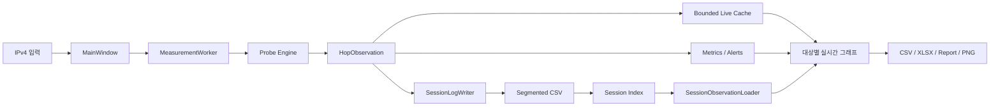

# MultiPingCheck 프로그램 구조

이 문서는 MultiPingCheck의 측정·저장·분석·UI 경계를 설명합니다.

## 1. 설계 목표

MultiPingCheck의 우선순위는 단순 기능 수보다 다음 운영 특성입니다.

1. 여러 IPv4 대상을 동시에 측정해도 한 대상의 timeout이 전체 UI를 멈추게 하지 않을 것
2. 장시간 실행 시 메모리와 thread가 계속 증가하지 않을 것
3. 실시간 화면과 장기 보존 데이터를 분리할 것
4. 프로그램 재시작 후에도 과거 세션을 다시 찾고 분석할 수 있을 것
5. 손상·누락된 저장 파일을 정상 데이터처럼 취급하지 않을 것
6. UI thread에서 장시간 세션 전체를 동기적으로 읽지 않을 것
7. 테스트가 실제 회사망이나 인터넷 연결을 필수로 요구하지 않을 것

## 2. 전체 데이터 흐름



## 3. 주요 모듈 책임

| 영역 | 책임 |
|---|---|
| `app/core/ping_runner.py` | Windows Ping 실행과 결과 정규화 |
| `app/core/probes.py` | 측정 엔진 경계 |
| `app/core/metrics.py` | Observation을 지연·손실 등 Metric으로 집계 |
| `app/core/analyzer.py` | 최종 대상과 경로 관측을 기반으로 분석 근거 생성 |
| `app/core/alerts.py` | 손실·지연·지연 변동 등 Alert 판단 |
| `app/ui/worker.py` | 다중 대상 측정 loop, start/stop/cancel 및 결과 signal |
| `app/ui/main_window.py` | 사용자 입력·상태·그래프·세션·export 조정 |
| `app/ui/latency_graph.py` | 실시간/과거 latency timeline 렌더링 |
| `app/ui/session_observation_loader.py` | 과거 세션 범위의 background 로딩 |
| `app/storage/session_log.py` | segmented CSV 저장·읽기·부분 손상 처리 |
| `app/storage/session_index.py` | 세션 상태·segment·샘플 수·복구 메타데이터 관리 |
| `scripts/soak_test.py` | deterministic 장시간 부하 시뮬레이션 |
| `scripts/verify_release.py` | 테스트·Qt·export·50-target soak를 묶는 release gate |

## 4. MainWindow는 측정 엔진이 아니다

`MainWindow`는 직접 Ping을 보내지 않습니다.

UI의 역할은 다음과 같습니다.

- IPv4 입력 검증
- MeasurementWorker 시작·중지
- Worker signal을 화면·저장·알림 상태에 반영
- 시간 범위 요청과 background loader 조정
- 저장된 세션 열기·삭제·내보내기

실제 네트워크 I/O를 UI thread에서 직접 수행하지 않는 것이 핵심 경계입니다.

## 5. 실시간 메모리와 전체 세션 저장소 분리

장시간 측정 데이터를 전부 Python list에 계속 보관하면 메모리가 측정 시간에 비례해 증가할 수 있습니다.

현재 구조는 두 계층을 사용합니다.

### Live Cache

실시간 그래프가 최근 데이터를 빠르게 그리기 위한 메모리 캐시입니다.

- 최근 관측 위주 보존
- 시간 기반 retention
- 최대 Observation 수 제한
- 대상별 deque를 별도로 유지해 특정 대상의 그래프 조회 비용을 줄임

### Session Storage

전체 측정 이력은 디스크의 segmented CSV로 지속 저장합니다.

그래프에 메모리 범위 밖의 과거 데이터가 필요할 때만 Session Storage에서 필요한 범위를 읽습니다.

이 구조는 **장기 저장 용량과 실시간 UI 메모리 사용량을 분리**합니다.

## 6. Segmented Session Storage

세션 저장은 하나의 무제한 CSV에 모든 데이터를 계속 추가하는 방식이 아닙니다.

Session Index에는 다음과 같은 메타데이터가 남습니다.

- Session ID
- 대상
- 시작/종료 시각
- 측정 방식과 Probe Engine
- 대상 수
- 샘플 수
- Segment 경로
- Session 상태
- 마지막 오류

세션 파일은 대상과 월 기준 bucket으로 관리할 수 있어 긴 이력을 나눠 처리합니다.

### 복구 원칙

프로그램 시작/새로고침 시 다음 상태를 구분합니다.

- 정상 보관 세션
- 일시중지/비정상 종료 후 복구된 세션
- 실제 파일이 사라져 삭제 예정으로 표시된 세션
- 일부 행을 건너뛰어 부분 복구된 세션
- 읽을 수 없는 손상 세션

부분 복구 또는 오류가 발생했으면 그 사실을 숨기지 않고 상태/오류 코드로 남깁니다.

## 7. 시간 범위 로더와 QThread lifecycle

실시간 그래프는 최근 범위와 `측정 전체`를 전환할 수 있습니다.

최근 데이터가 Live Cache에 있으면 메모리 데이터를 사용하지만, 긴 과거 범위는 `SessionObservationLoader`가 background thread에서 읽습니다.

중요한 lifecycle 규칙은 다음과 같습니다.

1. 요청마다 generation/request ID를 부여
2. 현재 요청과 다른 오래된 결과는 폐기
3. 이전 QThread의 `finished` callback이 새 loader를 제거하지 못하게 함
4. 취소 중인 loader의 정리가 끝나기 전에 참조를 잘못 교체하지 않음
5. 같은 범위 요청은 캐시가 이미 충족하면 불필요하게 다시 읽지 않음

이 경계는 장시간 50-target 측정 후 시간 범위를 반복 변경하는 상황에서 특히 중요합니다.

## 8. 다중 대상 그래프

기본 UI는 대상마다 별도 그래프 행을 사용합니다.

각 행은 다음 정보를 가질 수 있습니다.

- 이름/IPv4
- 현재 상태
- 현재/평균 지연 및 손실 관련 Metric
- 실시간 latency timeline
- 개별 일시중지
- 개별 제거

모든 대상에는 공통 시간 범위를 적용할 수 있습니다.

대상 수가 많을 때 한 번에 모든 위젯을 생성해 UI event loop를 오래 점유하지 않도록 batch 생성/렌더링 제어가 포함되어 있습니다.

## 9. Worker 종료와 저장 무결성

`중지`는 화면 상태만 바꾸는 버튼이 아닙니다.

정상 종료에서는 다음이 함께 확인되어야 합니다.

```text
측정 중지 요청
→ 새 Probe 시작 중단
→ 실행 중 작업 정리
→ 남은 Session Log queue 반영
→ Writer flush/close
→ Worker 종료
→ Session Index 최종 상태 기록
```

Soak test는 단순히 프로세스가 살아 있는지보다 다음 지표를 같이 확인합니다.

- `stopped_cleanly`
- active thread 수
- pending ping 수
- session log row/segment 수
- log queue depth

## 10. Export 경계

Export는 현재 UI에 보이는 일부 값만 복사하는 기능이 아닙니다.

지원 경로에는 다음이 포함됩니다.

- Raw/Observation CSV
- XLSX
- TXT/HTML 보고서
- 그래프 PNG
- 통계 CSV/XLSX
- 저장 세션 export

세션 전체를 읽어야 하는 export도 가능한 한 UI thread를 막지 않는 background 작업으로 분리합니다.

## 11. 공개 테스트 경계

자동 검증에서는 다음을 사용합니다.

- fake/simulated Probe
- reserved documentation IPv4
- 임시 디렉터리
- offscreen Qt
- synthetic latency/loss/timeout pattern

자동 테스트에 다음을 넣지 않습니다.

- 회사 장비 IP
- 실제 고객/사이트 정보
- 사내 DNS/게이트웨이 목록
- 실제 회사 로그
- 계정·Token·비밀번호

실제 네트워크 호환성 확인은 별도의 허가된 field smoke로 구분합니다.
